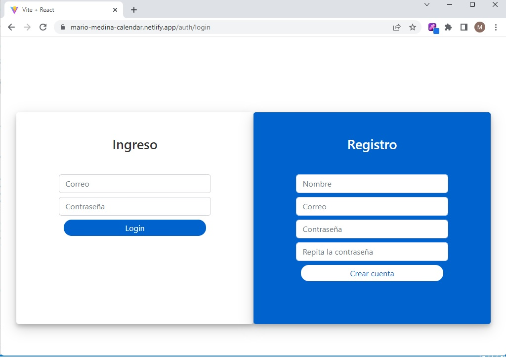

# Guía de inicio rápido: MERN CRUD Calendar

MERN,(Calendar utilizando Mongo, Express, React y Node. Primero [instala Compose](https://docs.docker.com/compose/install/).

#### Auth


#### Calendar


### Herramientas utilizadas

```
Node
Express
Mongoose
Modelos
Controllers
Middlewares de Express
JWT
Autenticación pasiva
Payload
Encriptación
Rutas
CORS
Revalidar tokens
MongoDB
MongoAtlas
MongoCompass
```

## Deploy con docker compose

```
$ docker compose up -d
```

## Resultados esperados

La lista de contenedores debe mostrar un contenedor en ejecución y la asignación de puertos como se muestra a continuación:
```
$ docker ps
CONTAINER ID   IMAGE                           COMMAND                  CREATED          STATUS                    PORTS                               NAMES
85701f66ccf8   react_django_mysql01-frontend   "docker-entrypoint.s…"   3 minutes ago    Up 3 minutes             0.0.0.0:3000->3000/tcp              docker_react
```

Luego vaya a `http://localhost:3000/` en su navegador web.

Puede ver la SPA en [netlify](https://mario-medina-calendar.netlify.app/)